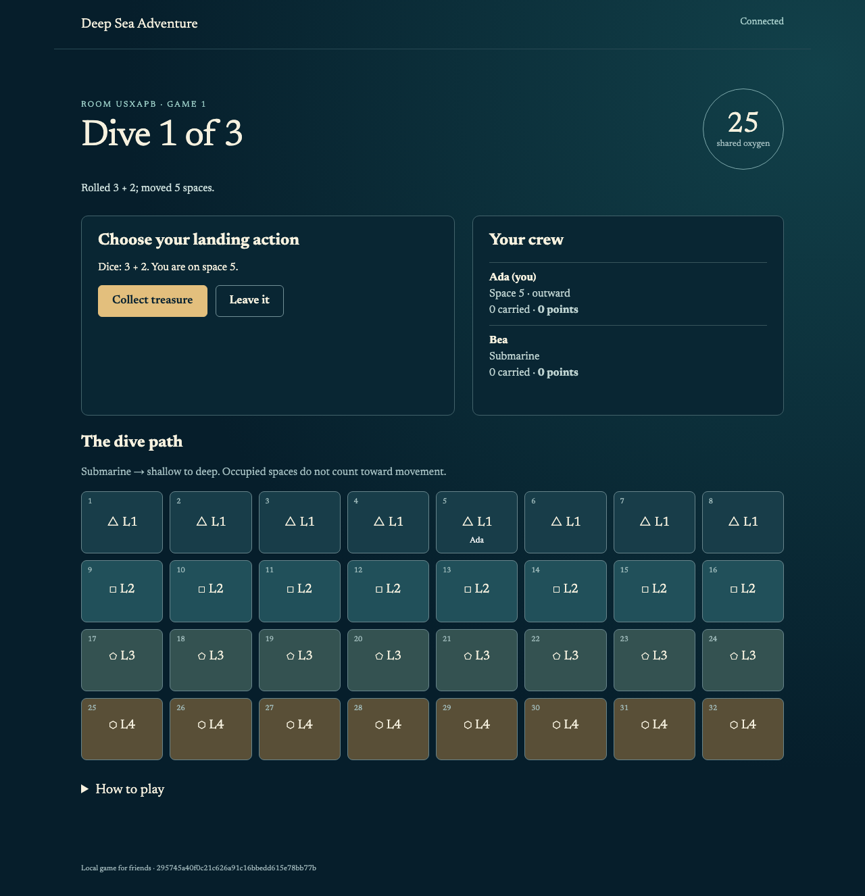

# 1. Build a game: Deep Sea

Let's build a game you can play with friends. Each player is a diver looking for treasure. Everyone shares the oxygen supply. Carry more treasure and you use more oxygen; stay down too long and you lose what you collected. After three dives, the player with the most treasure wins.

We'll build a browser version of Deep Sea Adventure. You'll describe the game, answer a few product questions and try what the agent builds. The Machina Practica skills handle the development method: where decisions belong, how to divide the work, which components to reuse and how to verify the result.

## Set up an empty project

You'll need a coding agent that can edit files and run commands. This walkthrough uses Codex and the Machina Practica skills. Start with a checkout of [the Machina Practica repository](https://github.com/machinapractica/practica), then run this command from that checkout:

```sh
python3 scripts/install-project-skills.py ../deepsea-learning
```

Open `deepsea-learning` in Codex. The installer puts the skills and their supporting files in the project's `.agents` directory. Select `practica-vision` from the skill picker; if it doesn't appear in an existing session, restart that session.

We'll keep the game local for this exercise. You can test two players using separate browser profiles on one computer. The agent will set up the application's tools and give you the command to run it.

## Describe the game

Give the agent this request:

```text
$practica-vision I want to build Deep Sea Adventure as a multiplayer web game for friends on their own devices. Write the README and vision.
```

Read the result. Does it describe the game you want to make? The agent may ask whether you want a faithful adaptation or changes to the rules, and whether the friends will be together or remote. Those are useful questions: their answers change the product.

The vision skill already knows that the vision describes the intended experience and that implementation decisions belong elsewhere. You don't have to teach it that in your prompt.

For this exercise, choose the base game and GPLv3 for your code. We'll use the [rules summary prepared for Deepsea](https://github.com/anicolao/deepsea/blob/f7caf9f4d7473f637ac6cbc71509f545c59e8d9a/RULES_SUMMARY.md) as starting material. It identifies its sources and labels the conventions chosen for that implementation. Use simple original graphics.

## Get the first page running

Continue in the same session:

```text
The vision is accepted. Use a faithful base-game adaptation for friends, with GPLv3 for our code. Use the rules and explicitly documented project conventions in https://github.com/anicolao/deepsea/blob/f7caf9f4d7473f637ac6cbc71509f545c59e8d9a/RULES_SUMMARY.md as the starting material.

$practica-project Summarize the rules, then build and verify the blank web application. Keep this trial local for now.
```

`practica-project` selects the skills needed for the request. Here it uses the domain skill to establish the rules, then the scaffold skill to get the application running. A scaffold is the smallest running application with its build and tests in place.

Read the rules summary. Check when oxygen is used, how treasure slows a diver, what happens to lost treasure and how the next dive begins. If a rule differs from the game you want, resolve that product decision now.

Then start the application using the command the agent provides. You'll see a simple page identifying the game. It won't have playable controls yet. The first running version establishes the build and browser checks before game behavior is added.

The agent should also give you a verification result and screenshots from phone and desktop layouts. Open the screenshots. Review the page before accepting its screenshots as the reference for later runs. Subsequent checks should match that reference with zero changed pixels in the same rendering environment. The scaffold skill supplies those requirements; they aren't extra instructions for you to paste into every request.

## Build the playable game

Once you've accepted the rules and tried the page, ask for the game:

```text
The rules and blank app are accepted.

$practica-project Design and plan the playable Deep Sea game, then implement the plan. Keep it local for this trial, with friends joining from separate browsers. I want to play a complete three-dive game and start another one.
```

This request authorizes the agent to work through design, planning and implementation. You can read the documents as it goes. You don't need to approve each file before it can continue.

The design describes what players can do and how their browsers agree on the game. The plan divides that design into usable steps: get players into a room, play turns, finish dives and show the result. The implementation skill builds and checks those steps, using shared packages where they fit.

These are responsibilities of the skills. Your prompt supplies the outcome: a complete game for friends, running locally. You can make a different product choice without rewriting the development procedure.



## Play it

Use the agent's run instructions. Open the game in two separate browser profiles so each player has their own identity.

1. Create a room with the first player, then use its room code to join as the second.
2. Choose the first diver and start the game.
3. Take turns collecting treasure. Watch the shared oxygen and decide when to return.
4. Reload one player's browser during play. Continue from the same turn.
5. Finish all three dives, read the result and start another game.

After a dive, stranded players confirm the order of their lost treasure. Once everyone has finished, the host can start the next dive.

Try both sides of the central decision. Return early with a little treasure, then try a dive where you keep going until the oxygen runs out. The rules should make the consequences clear in both browsers.

Look at the agent's verification report alongside your own playthrough. It should say which journeys were tested, which build was tested and where to find the screenshots. Automated checks and your review answer different questions: the checks establish specific behavior; playing tells you whether the game makes sense to a person.

If you find a problem, describe what you did, what happened and what you expected. “I saw Alice join, then she disappeared from my roster” gives the agent a defect to investigate. The agent should reproduce it and fix the cause. A recurring failure is a reason to improve the relevant skill or shared component.

[Trial results and scope](../../docs/trials/deepsea/README.md) record what has actually been exercised for this draft.
